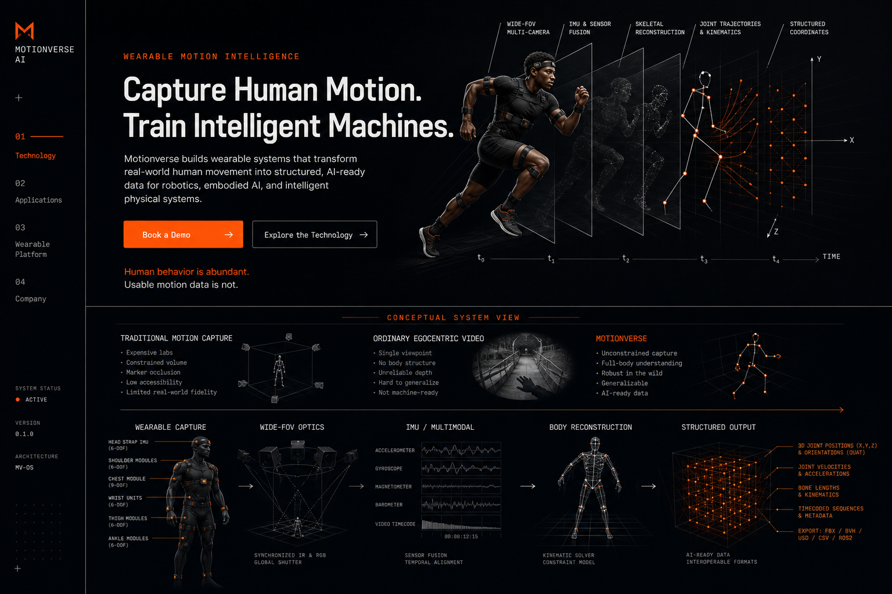

# Motionverse AI Current Design Audit

## Audit scope

The repository was empty at the start of the redesign, so there was no existing runtime flow, responsive implementation, or interactive state to capture. The audit therefore used the selected visual concept from the current design process as the source surface:

User goal: understand what Motionverse does, why the approach differs, who it is for, and how to start a conversation.

Accessibility target: readable hierarchy, strong contrast, keyboard-operable controls, reduced-motion support, responsive reflow, and practical text sizes.

## Step 1 — Hero and navigation

Health: strong visual foundation, major narrative correction required.

Strengths:

- Black, off-white, and signal-orange identity is distinctive and disciplined.
- Editorial headline, technical labels, and temporal reconstruction establish an engineering-led tone.
- Primary and secondary actions are visible.

UX risks:

- The sensor-suit athlete mispositions the company as a body-mounted IMU motion-capture system.
- Vertical rail and system status language make the page feel like a concept dashboard.
- Hero, comparison, pipeline, hardware, and output formats compete in one viewport.

Accessibility risks visible from the source:

- Several annotation labels are too small for comfortable reading.
- Dense lower-screen detail creates a challenging scan path.
- Interactive and focus states cannot be verified from a static visual.

## Step 2 — Data comparison

Health: useful framing, technically overconfident copy.

Strengths:

- The three-part continuum is more informative than generic cards.
- Portability versus structured output is the right strategic contrast.

UX risks:

- “Not machine-ready” oversimplifies raw egocentric video.
- Unsupported qualitative and technical claims appear conclusive.

Recommendation implemented:

- Reframe raw egocentric video as scalable and natural, while explaining the reconstruction, synchronization, annotation, and post-processing gap.
- Present qualitative dimensions without scores.

## Step 3 — Technology and outputs

Health: visually memorable, too dense and partially unverified.

Strengths:

- Exploded system language gives the company physical credibility.
- Timeline, coordinate, and structured-output motifs support the brand.

UX risks:

- Full-body sensor modules reinforce the wrong product model.
- Detailed file formats and kinematic outputs imply confirmed production readiness.
- Too much technical material arrives before the visitor has understood the core story.

Recommendation implemented:

- Center the platform on lightweight glasses and optional modular sensing.
- Label product views as conceptual.
- Use safer output categories: body motion, hand trajectories, interaction, temporal sequences, spatial data, and custom downstream formats.
- Pace the technology across dedicated sections.

## Evidence limits

- The source was a static visual, so loading, keyboard navigation, animation, focus, validation, and responsive behavior could not be audited before implementation.
- No existing repository content or public company evidence was available to validate product readiness, customers, partnerships, metrics, detailed output formats, legal information, or contact details.
